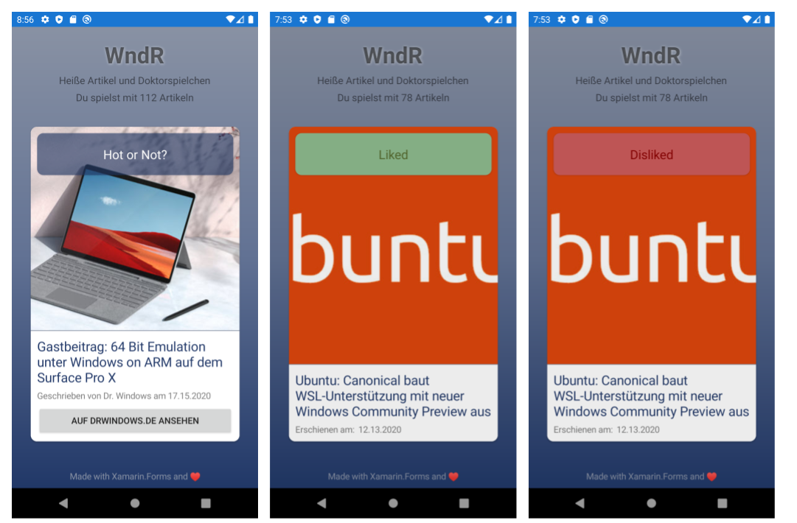

# xamarin-drwndr-app
> The Dr. Windows "DrwndR" app is a simple project that is meant to share the joy of sparetime software development. It uses a via GitHub Action downloaded archive of Dr. Windows feed entries as a data source for a more or less Tinder-inspired swipe-ish app.

## tl;dr
This is neither an offical [Dr. Windows](https://www.drwindows.de) app nor anything other than a highly motivated playground to dive deep into the Xamarin.Forms ecosystem with a a lot of fun  in mind.

This project is written and owned by a beginner and meant for beginners. It would be perfect if experts could mentor the project - but this is just a mind in the clouds.

If you are looking for other Xamarin.Forms app of mine, you maybe want to have a look at my [Microsoft Surface Duo](https://www.microsoft.com/en-us/surface/devices/surface-duo)  apps targeted apps called "[Hinge It (game)](https://github.com/tscholze/xamarin-surface-duo-hinge-it) and "[Road To Surface Duo](https://github.com/tscholze/xamarin-road-to-surface-duo)".

## D: Was ist DrWndR?
Mit dieser App möchte ich euch zeigen wie man in wenig Zeit und nur mit kostenfreien Mitteln Spaß an der Software Entwicklung mit Microsof Xamarin.Forms und GitHub Actions hat. Die App ist absolut nicht gedacht als Lehrbeispiel für Softwarearchitektur als auch nicht für den Einsatz in "realen" Umgebungen. Wir wollen Spaß haben und eventuell hier nicht alles so ernst nehmen wie es zur Zeit auf der Welt Gang und gäbe ist.

## App screenshots

**Animations**

**Swipe states**

## Releases

> No public releases beside the code is planned.

## Structure

**DrWndr**

Xamarin.Forms container that includes all shared functionality and features.

**DrWndr.Android**

Android wrapper and platform-specifc implementations like custom rendereres, effects or assets.

**DrWndr.iOS**

iOS wrapper and platform-specifc implementations like custom rendereres, effects or assets.

**DrWndr.Converter**

Converts bunch of xml feed files into one aggregated and simplified JSON

## Prerequirements
- Windows 10 / macOS 
- [Visual Studio 2019](https://visualstudio.microsoft.com/) (for Mac)
- Installed Xamarin Visual Studio plugins

## Known issues
The iOS app lacks a support of a image in each card. This will maybe fixed in the future.

## Keep in mind
This app is purely build for having fun! All features have room for improvements or could be done more elegant.

## Contributing
Feel free to improve the quality of the code. It would be great to learn more from experienced C#, Xamarin and Azure developers.
Please use the "default" workflow of contributing to this project.
1. Open an issue and describing your idea or bug finding
1. Fork repository
1. Fix bug / add enhancement in well named feature branch with issue number (e.g. `user.name/2-added-app-icon`)
1. Add the issue number to your commit message (e.g. `#2 Added new app icon`)
1. Create pull request (PR) from your feature branch to this `master` branch 
1. Please keep in touch with your PR to answer upcoming questions
1. If your PR got merged, check if you are listed in the "Authors" section of the readme

## Special thanks to
- [Martin Geuss](https://twitter.com/martingeuss) (Dr. Windows) for letting me publish an article series on one of the largest German speaking Microsoft communities and portals [Dr. Windows](https://drwindows.de)

## Authors
Just me, [Tobi]([https://tscholze.github.io).

## Links
- [Dr. Windows](https://www.drwindows.de) German Microsoft blog
- [Xamarin](https://dotnet.microsoft.com/apps/xamarin) Homepage

## License
This project is licensed under the MIT License - see the [LICENSE](LICENSE) file for details.
Dependencies or assets maybe licensed differently.

